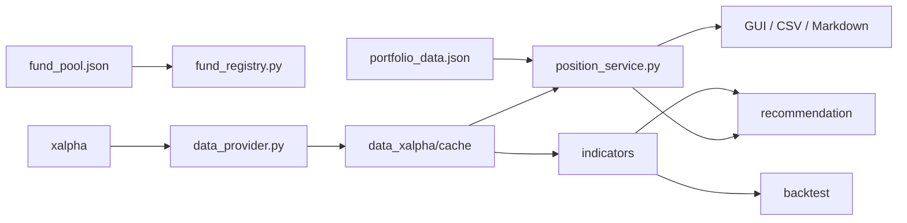

# 天玑个人基金组合分析与回测系统 V1.0

一个基于 [xalpha](https://github.com/refraction-ray/xalpha) 的 Windows 桌面基金分析工具。

它可以管理基金池和持仓批次，获取并缓存历史净值，计算收益风险指标，执行定投与均线回测，还会给出可解释的规则化策略建议。它不会连接交易账户，也不会替你按下买入按钮。毕竟，代码可以算夏普比率，但不能替你承担回撤。

> [!IMPORTANT]
> 本项目仅用于个人基金数据分析、学习记录、组合分析和回测辅助，不构成投资建议、收益承诺或交易指令。历史数据和回测结果不代表未来表现。

## 功能

- **基金池管理**：添加、编辑、启用、停用和删除基金。
- **净值获取与缓存**：通过 xalpha 获取基金数据，远程失败时回退到已有真实缓存。
- **持仓与交易**：记录买入、卖出、手续费和确认份额。
- **持仓批次**：支持同一基金多次买入，并按 FIFO 处理卖出份额。
- **统一估值**：根据剩余份额和最新单位净值计算市值、成本、收益及组合权重。
- **收益风险分析**：阶段收益、年化收益、波动率、最大回撤、夏普比率和卡玛比率等。
- **量化指标**：MA20/60/120/250、RSI14、近期回撤和新高新低信号。
- **策略回测**：固定定投、动态定投和均线策略。
- **策略建议**：根据趋势、位置、风险、持仓和定投配置生成可解释建议。
- **桌面界面**：12 个功能页面，包含表格、图表、日志和数据状态。
- **结果导出**：生成 CSV、PNG 和 Markdown 报告。

## 界面页面

| 页面 | 主要内容 |
|---|---|
| 总览与图表 | 总资产、累计收益、资产配置和分析图表 |
| 持仓明细 | 净值、市值、成本、收益、权重和净值趋势 |
| 交易流水 | 登记确认买入、卖出和撤销允许撤销的交易 |
| 持仓批次 | 管理多笔买入记录、剩余份额和数据质量 |
| 基金池管理 | 维护基金代码、分类、类型和定投参数 |
| 数据中心 | 查看数据来源、缓存状态和错误信息 |
| 收益与风险 | 阶段收益和单基金风险指标 |
| 定投模拟 | 基础定投结果 |
| 量化指标 | 基金及组合指标数据集 |
| 策略回测 | 固定定投、动态定投和均线策略 |
| 策略建议 | 普通基金、定投基金和卖出风险提示 |
| 运行日志 | 查看数据更新、估值和分析过程 |

## 环境要求

- Windows 10/11（推荐 64 位）
- Python 3.10 或更高版本（项目当前主要按 Python 3.10 验证）
- Python 安装中包含 Tkinter
- 可访问 xalpha 所依赖的公开基金数据源
- 建议预留至少 500 MB 磁盘空间，用于虚拟环境、净值缓存和分析输出

GUI 使用 Python 标准库中的 Tkinter。项目主要按 Windows 桌面环境开发，打开输出目录和报告等功能使用了 Windows 的 `os.startfile()`，因此其他操作系统目前不是正式支持范围。

安装 Python 时建议从 [Python 官网](https://www.python.org/downloads/windows/) 获取安装程序，并勾选：

- `Add Python to PATH`
- `pip`
- `tcl/tk and IDLE`

安装后可以检查版本和 Tkinter：

```powershell
python --version
python -m tkinter
```

第二条命令正常时会打开一个 Tkinter 测试窗口，关闭即可。如果提示找不到 `tkinter`，需要重新安装带 Tcl/Tk 组件的 Python。

## 快速开始

### 1. 获取代码

```bash
git clone https://github.com/LinkMao6/TianJi_2601_Personal-Fund-Position-Analysis-System.git
cd TianJi_2601_Personal-Fund-Position-Analysis-System
```

如果没有安装 Git，也可以在 GitHub 仓库页面选择 `Code → Download ZIP`，解压后进入项目目录。

### 2. 创建虚拟环境

在项目根目录打开 PowerShell：

```powershell
python -m venv .venv
.\.venv\Scripts\Activate.ps1
```

激活成功后，命令行开头通常会显示 `(.venv)`。

如果 PowerShell 提示脚本执行被禁止，可以仅为当前窗口临时调整策略：

```powershell
Set-ExecutionPolicy -Scope Process -ExecutionPolicy Bypass
.\.venv\Scripts\Activate.ps1
```

也可以不激活虚拟环境，后续命令直接使用：

```powershell
.\.venv\Scripts\python.exe
```

### 3. 安装依赖

激活虚拟环境后执行：

```powershell
python -m pip install --upgrade pip
python -m pip install -r requirements.txt
```

`requirements.txt` 包含主程序运行所需的固定版本：

```text
xalpha==0.12.3
pandas==1.5.3
numpy==1.26.4
matplotlib==3.10.9
```

依赖用途：

| 依赖 | 用途 |
|---|---|
| `xalpha` | 获取基金信息、历史单位净值和累计净值 |
| `pandas` | 表格、CSV 和时间序列处理 |
| `numpy` | 数值计算 |
| `matplotlib` | GUI 内嵌图表和 PNG 图表输出 |
| `tkinter` | 桌面 GUI，由 Python 标准库提供，不通过 pip 安装 |

xalpha 还会安装其自身依赖。请优先使用 `requirements.txt` 中的固定版本，不建议在首次运行前单独升级其中某个核心包，否则可能收获一个很新、但彼此不太认识的依赖组合。

### 4. 验证安装

执行：

```powershell
python -c "import xalpha, pandas, numpy, matplotlib, tkinter; print('环境安装成功')"
```

如果输出：

```text
环境安装成功
```

说明主程序依赖已经可以导入。

还可以检查项目模块：

```powershell
python -c "import main, ui_app, run_portfolio; print('项目模块导入成功')"
```

### 5. 启动桌面程序

```powershell
python main.py
```

`main.py` 是统一 GUI 入口，`python ui_app.py` 仍可兼容启动。

如果没有激活虚拟环境：

```powershell
.\.venv\Scripts\python.exe main.py
```

### 6. 命令行运行完整分析

```powershell
python run_portfolio.py
```

命令行入口适合在已经配置基金池和持仓后批量生成分析结果。空仓库首次启动后，请先使用 GUI 添加基金和录入持仓，否则命令行分析没有可处理的数据。

### 7. 可选工具依赖

`tools/` 目录不是主程序运行所必需的。只有在使用截图和 Word 文档生成脚本时，才需要额外安装：

```powershell
python -m pip install Pillow python-docx
```

| 可选依赖 | 对应工具 |
|---|---|
| `Pillow` | `tools/capture_manual_screenshots.py` |
| `python-docx` | `tools/generate_*_doc.py` |

不安装这两个包不会影响 `python main.py`、组合分析、回测或策略建议。

## 安装问题排查

### `python` 命令不存在

重新安装 Python 并勾选 `Add Python to PATH`，或使用 Python Launcher：

```powershell
py -3.10 -m venv .venv
```

### PowerShell 无法激活虚拟环境

使用当前进程临时策略：

```powershell
Set-ExecutionPolicy -Scope Process -ExecutionPolicy Bypass
```

或者始终直接调用：

```powershell
.\.venv\Scripts\python.exe main.py
```

### 缺少 `tkinter`

`tkinter` 不能通过 `pip install tkinter` 正确补齐。请修改或重新安装 Python，并启用 Tcl/Tk 组件。

### xalpha 安装或导入失败

先确认正在使用虚拟环境中的 Python：

```powershell
python -c "import sys; print(sys.executable)"
python -m pip show xalpha
```

必要时重新安装固定版本：

```powershell
python -m pip install --force-reinstall xalpha==0.12.3
```

### 无法获取基金数据

xalpha 依赖第三方公开数据源。网络、代理、TLS、上游接口调整或访问频率限制都可能造成失败。

- 首次使用且没有缓存时，远程失败会导致对应基金无法分析。
- 已有真实缓存时，程序会回退到缓存并显示数据来源和净值日期。
- 缓存可用不代表数据已经更新到当天，请查看“数据中心”和净值截止日期。
- 不要把代理账号、Cookie、Token 或其他凭据写入源码后提交到 GitHub。

## 首次运行

开源仓库不附带任何个人持仓或交易数据。

- `fund_pool.json` 初始为空基金池。
- `portfolio_data.json` 不纳入 Git；首次读取组合数据时自动创建空白文件。
- `data_xalpha/cache/` 在需要缓存基金净值时自动创建。
- `logs/` 在程序初始化日志时自动创建。
- `output/` 在加载分析模块或执行分析时自动创建。
- `data/history/` 在保存策略建议历史时自动创建。

首次创建的组合数据结构如下：

```json
{
  "version": 3,
  "data_profile": "user",
  "holdings": [],
  "transactions": [],
  "lots": [],
  "position_summary": {}
}
```

## 使用流程

1. 在“基金池管理”中添加六位基金代码、名称、分类和基金类型。
2. 通过“交易流水”或“持仓批次”录入真实确认金额、净值、份额和手续费。
3. 点击“开始分析”，程序会尝试更新远程净值并重估持仓。
4. 在收益风险、量化指标、策略回测和策略建议页面查看结果。
5. 在 `output/` 中查看生成的 CSV、图表和报告。

建议优先使用真实确认批次。只录入历史持仓金额但没有份额时，系统只能进行估算，并会明确标记数据质量。

## 项目结构

```text
xalpha_portfolio_analyzer/
├── main.py                    # GUI 统一入口
├── app_info.py                # 软件名称、版本和免责声明
├── app_logging.py             # 轮转日志配置
├── ui_app.py                  # Tkinter 桌面应用
├── run_portfolio.py           # 完整分析流程编排
├── portfolio_analysis.py      # 收益、风险、图表和报告
├── portfolio_store.py         # 持仓、交易、批次和数据迁移
├── position_service.py        # 统一持仓估值
├── fund_registry.py           # 基金池增删改查
├── data_provider.py           # xalpha 数据源和本地缓存
├── quant_service.py           # 指标与回测应用服务
├── fund_pool.json             # 初始为空的基金池配置
├── requirements.txt
├── indicators/                # 基金与组合指标
├── backtest/                  # 回测引擎
├── recommendation/            # 建议模型、评分、规则和服务
└── tools/                     # 截图及文档生成辅助脚本
```

运行后会生成但不会提交到 Git 的内容：

```text
portfolio_data.json
data/
data_xalpha/
logs/
output/
portfolio_report.md
```

## 数据链路



基金代码是跨模块关联的主要键。持仓明细、组合摘要、CSV 和策略建议尽量复用统一估值结果，减少“同一只基金在三个页面有四个金额”的奇妙体验。

## 数据与隐私

下列文件可能包含个人投资数据，已由 `.gitignore` 排除：

| 路径 | 内容 |
|---|---|
| `portfolio_data.json` | 持仓、交易、买入批次和估值摘要 |
| `data/history/` | 策略建议历史 |
| `data_xalpha/` | 基金净值缓存和数据源状态 |
| `logs/` | 运行日志和错误信息 |
| `output/` | CSV、图表及建议报告 |
| `portfolio_report.md` | 最近一次组合分析报告 |

`fund_pool.json` 会被 Git 跟踪，但开源版本保持为空。添加自己的基金后，如果准备向上游仓库提交代码，请先检查该文件，避免顺手公开个人基金清单。

本项目不会连接券商或基金销售账户，也不提供自动交易功能。所有业务数据默认保存在项目本地目录。

## 数据源与缓存

`data_provider.py` 使用“xalpha 远程数据源 + 本地 CSV 缓存”的组合：

- 普通基金使用 `xalpha.fundinfo`。
- 货币基金使用 `xalpha.mfundinfo`。
- 成功获取的数据写入 `data_xalpha/cache/<基金代码>.csv`。
- 远程更新失败时使用已有真实缓存。
- 远程和缓存均不可用时明确报错，不生成随机净值。
- 程序可能补入基金详情页已经正式公布、但历史接口尚未同步的最新单位净值。
- 盘中估算值不会被当成正式单位净值。

“使用本地缓存”不等于“已经更新到今天”。请同时查看净值截止日期和数据中心状态。

## 持仓与估值

`portfolio_data.json` 当前数据版本为 3，包含：

- `holdings`：基金级持仓汇总。
- `transactions`：确认交易流水。
- `lots`：逐笔买入批次和剩余份额。
- `position_summary`：最近一次组合估值摘要。

精确持仓的主要计算口径：

```text
当前市值 = 剩余确认份额 × 最新单位净值
持仓成本 = 未卖出批次成本 + 对应手续费
当前收益 = 当前市值 - 持仓成本
当前收益率 = 当前收益 / 持仓成本
```

卖出交易按买入日期顺序消耗批次份额，即 FIFO。V1.0 不支持直接撤销卖出交易，因为撤销 FIFO 链条远比撤销一杯没付款的咖啡麻烦。

## 指标与组合净值

指标优先使用累计净值 `totvalue`，没有累计净值时使用单位净值 `netvalue`。

主要指标包括：

- 总收益率和阶段收益率
- 年化收益率
- 年化波动率
- 最大回撤
- 夏普比率和卡玛比率
- 下行波动率
- RSI14
- MA20、MA60、MA120、MA250
- 近 252 日回撤
- 近期新高和新低信号

组合净值按分析时的当前持仓权重合成，不还原历史每个时点的真实动态仓位。不同基金的净值日期会进行对齐，组合截止日取所有有效成分共同拥有的最新正式净值日。

## 回测

当前支持三种策略：

| 策略 | 规则 |
|---|---|
| 固定定投 | 按日、周或月投入固定金额 |
| 动态定投 | 低于 MA60 投入 1.5 倍，高于或等于 MA60 投入 0.5 倍 |
| 均线策略 | MA20 高于 MA60 时持有，否则持有现金 |

回测输出包括累计投入、期末资产、收益金额、现金收益率、最大回撤、年化收益、波动率、夏普比率、卡玛比率、交易次数和每日资金曲线。

回测未完整模拟申购费、赎回费、滑点、限购、暂停申购和到账延迟，因此结果不等同于真实交易收益。

## 策略建议

策略建议是可解释的人工规则模型，不是机器学习预测，也没有偷偷训练一个会看 K 线的水晶球。

普通基金综合评分由以下维度组成：

```text
趋势评分 × 30%
+ 位置评分 × 25%
+ 风险评分 × 25%
+ 持仓评分 × 20%
```

债券基金采用更保守的风险权重。系统还针对货币基金、QDII、债券基金和黄金/商品基金提供不同规则或提示。

建议结果包含：

- 当前动作及建议金额
- 综合评分和四维评分
- 风险等级与置信度
- 规则触发原因
- 卖出风险信号
- 数据日期、来源和质量
- 免责声明

置信度仅表示数据和规则完整程度，不表示建议一定正确。

## 输出文件

完整分析可能生成：

| 文件 | 内容 |
|---|---|
| `output/summary.csv` | 组合资产、成本和收益摘要 |
| `output/holdings_result.csv` | 统一估值后的持仓明细 |
| `output/period_return.csv` | 阶段收益 |
| `output/risk_report.csv` | 收益风险指标 |
| `output/indicator_dataset.csv` | 基金及组合量化指标 |
| `output/portfolio_nav.csv` | 组合净值曲线 |
| `output/backtest_result.csv` | 回测绩效 |
| `output/backtest_curve.csv` | 回测资金曲线 |
| `output/dca_result.csv` | 基础定投模拟 |
| `output/fund_recommendation_report.md` | 策略建议报告 |
| `portfolio_report.md` | 组合分析报告 |

CSV 使用 `utf-8-sig` 编码，主要是为了让 Windows Excel 少一点猜谜活动。

## 开发说明

建议按以下顺序阅读代码：

1. `fund_registry.py`
2. `data_provider.py`
3. `portfolio_store.py`
4. `position_service.py`
5. `indicators/`
6. `backtest/`
7. `recommendation/`
8. `run_portfolio.py`
9. `ui_app.py`

修改数据字段时，应同步检查：

- `portfolio_data.json` 的版本迁移。
- `position_rows()` 和 `lot_rows()`。
- GUI 表格字段。
- CSV 输出格式。
- 策略建议的持仓上下文。

`tools/` 中的文档生成脚本使用 Pillow 或 `python-docx`，这些工具依赖不属于核心程序运行依赖，当前未写入 `requirements.txt`。

## 已知限制

- 依赖 xalpha 及其上游公开数据源，网络或页面变化可能导致更新失败。
- QDII 净值通常比境内基金滞后一个或多个交易日。
- 缺少真实确认份额的历史持仓只能估算。
- 组合历史净值使用当前持仓权重，不还原历史动态持仓。
- 回测没有覆盖全部交易费率和执行限制。
- 策略建议是固定规则，不预测未来价格。
- 卖出交易涉及 FIFO，V1.0 不能直接撤销。
- GUI 主要面向 Windows 10/11。
- 当前没有独立安装包、完整自动化测试体系和持续集成流程。

详情见 [`V1.0_KNOWN_LIMITATIONS.md`](V1.0_KNOWN_LIMITATIONS.md)。

## 第三方项目

本项目使用以下第三方组件：

- [xalpha](https://github.com/refraction-ray/xalpha)
- [pandas](https://pandas.pydata.org/)
- [NumPy](https://numpy.org/)
- [Matplotlib](https://matplotlib.org/)
- Tkinter / ttk

本项目不是 xalpha 官方项目，也不包含上述第三方库的源码。

## 贡献

欢迎提交 Issue 或 Pull Request。提交前建议：

1. 不要提交个人持仓、交易、日志、缓存或输出报告。
2. 确认新增代码可以在 Python 3.10+ 下运行。
3. 涉及计算口径的修改，请说明公式、假设和边界条件。
4. 涉及 GUI 的修改，请同时检查后台线程和主线程更新。

## License

本项目采用 [MIT License](LICENSE) 开源。你可以在遵守许可证条款并保留版权与许可声明的前提下使用、复制、修改、合并、发布和分发本项目。

## 免责声明

本软件仅用于个人基金数据分析、学习记录、组合分析和回测辅助，不提供自动交易功能。所有收益、风险、回测和策略建议均基于历史数据、公开数据及人工规则，仅供研究参考，不构成任何投资建议、收益承诺或交易指令。

使用者应自行核对基金代码、净值日期、确认金额、份额、手续费及基金公告，并独立作出判断、承担使用风险。
