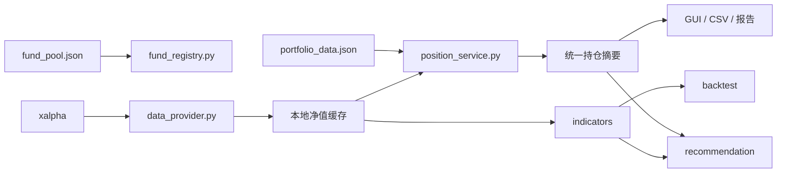

# 天玑个人基金组合分析与回测系统 V1.0

软件简称：天玑基金组合分析系统  
版本号：V1.0

基于 [xalpha](https://github.com/refraction-ray/xalpha) 的 Python 桌面端个人基金数据分析、学习记录、组合分析与回测辅助工具。项目覆盖基金池、净值缓存、真实持仓批次、收益风险指标、定投与均线回测、规则化策略建议，以及 CSV、图表和 Markdown 报告输出。

> V1.0 申报基线已经冻结，主要面向 Windows 桌面环境。  
> 本软件仅用于个人基金数据分析、学习记录、组合分析和回测辅助，不提供自动交易功能。所有收益、风险、回测和策略建议均基于历史数据、公开数据及人工规则，仅供研究参考，不构成任何投资建议、收益承诺或交易指令。历史数据和回测结果不代表未来表现，使用者应自行核对数据、独立作出判断并承担使用风险。

## V1.0 申报基线

- 软件全称：天玑个人基金组合分析与回测系统 V1.0
- 软件简称：天玑基金组合分析系统
- 版本号：V1.0
- 申报定位：个人基金数据分析、学习记录、组合分析与回测辅助工具
- 功能范围：以 [`V1.0_FUNCTION_BASELINE.md`](V1.0_FUNCTION_BASELINE.md) 为准
- 范围控制：V1.0 冻结后不再增加非必要复杂功能，仅处理阻断运行、明显计算错误、跨页面数据不一致或文档与实际功能明显不符的问题

## 功能概览

- 动态基金池：添加、编辑、启用、停用和删除基金。
- 数据获取：通过 xalpha 获取基金名称、单位净值和累计净值。
- 本地缓存：网络失败时使用已有真实缓存，不生成随机净值或随机收益。
- 持仓批次：支持同一基金多次买入、批次编辑、成本和份额重建。
- 最新净值估值：根据剩余份额和最近一次成功获取或缓存的最新净值计算市值、收益与收益率。
- 收益风险：阶段收益、年化收益、波动率、最大回撤、夏普和卡玛等。
- 组合分析：资产配置、组合净值和组合级风险指标。
- 策略回测：固定定投、动态定投和均线策略。
- 策略建议：根据趋势、位置、风险、仓位和定投配置生成可解释建议。
- 桌面 GUI：提供 12 个功能页面、内嵌图表、日志和数据状态。
- 分析输出：生成 CSV、PNG、Markdown 报告及建议历史记录。

## 界面模块

| 页面 | 主要功能 |
|---|---|
| 总览与图表 | 总资产、累计收益、资产配置和组合图表 |
| 持仓明细 | 最新净值、市值、成本、收益、权重和净值趋势 |
| 交易流水 | 登记确认买入/卖出及撤销允许撤销的交易 |
| 持仓批次 | 管理同一基金的多笔买入记录和剩余份额 |
| 基金池管理 | 动态维护基金代码、分类、类型和定投参数 |
| 数据中心 | 查看数据源、缓存更新时间和错误状态 |
| 收益与风险 | 阶段收益与单基金风险指标 |
| 定投模拟 | 基础定投结果 |
| 量化指标 | 基金与组合通用指标数据集 |
| 策略回测 | 固定定投、动态定投、均线策略和资金曲线 |
| 策略建议 | 普通基金、定投基金和卖出风险建议 |
| 运行日志 | 查看数据更新、估值和分析执行信息 |

## 快速开始

### 环境要求

- Python 3.10 或更高版本
- Windows 10/11 推荐
- 可访问 xalpha 所依赖的数据源

### 安装依赖

```bash
python -m venv .venv
.venv\Scripts\activate
pip install -r requirements.txt
```

当前依赖：

```text
xalpha==0.12.3
pandas==1.5.3
numpy==1.26.4
matplotlib==3.10.9
```

### 启动 GUI

```bash
python main.py
```

`main.py` 是 V1.0 统一启动入口。原 `python ui_app.py` 入口保留兼容。

### 命令行完整分析

```bash
python run_portfolio.py
```

首次获取基金数据可能较慢。后续分析会复用本地缓存；点击“重新分析”时会优先尝试更新远程数据。

仓库当前随附的 `portfolio_data.json` 是 V1.0 功能演示使用的模拟持仓数据，GUI 页眉会显示“V1.0 模拟演示数据”。删除该文件后，程序会创建空白用户数据结构，不会自动写入另一套内置金额。

## 项目结构

```text
xalpha_portfolio_analyzer/
├── main.py                    # V1.0 统一 GUI 启动入口
├── app_info.py                # 软件名称、版本和免责声明
├── ui_app.py                  # Tkinter 桌面应用
├── run_portfolio.py           # 完整分析流程编排
├── portfolio_analysis.py      # 收益、风险、图表和报告
├── portfolio_store.py         # 持仓、交易、批次和数据迁移
├── position_service.py        # 统一持仓估值与组合摘要
├── fund_registry.py           # 基金池增删改查
├── data_provider.py           # xalpha 数据源与缓存
├── quant_service.py           # 指标和回测应用层
├── indicators/                # 单基金与组合指标
├── backtest/                  # 通用回测引擎
├── recommendation/            # 策略建议模型、评分与服务
├── fund_pool.json             # 基金池配置
├── portfolio_data.json        # 版本化持仓数据
├── requirements.txt
├── data_xalpha/cache/         # 本地真实净值缓存
├── data/history/              # 策略建议历史
├── logs/                      # 运行日志
└── output/                    # CSV、图表和报告
```

## 数据与输出目录

| 路径 | 用途 | 是否属于用户业务数据 |
|---|---|---|
| `fund_pool.json` | 基金池、分类、启停和定投配置 | 是 |
| `portfolio_data.json` | 持仓、交易流水、买入批次和最近估值摘要 | 是 |
| `data_xalpha/cache/` | 从公开数据源成功获取的基金净值缓存 | 否，属于可再获取缓存 |
| `data_xalpha/cache/provider_status.json` | 最近一次数据源更新状态 | 否 |
| `data/history/` | 策略建议历史 | 是 |
| `logs/` | 运行日志 | 否 |
| `output/` | CSV、PNG 和策略建议报告 | 否，属于生成结果 |
| `portfolio_report.md` | 最近一次组合分析报告 | 否，属于生成结果 |

切换整套持仓时，核心文件是 `portfolio_data.json`。若新持仓包含不同基金，还应同步准备相应的 `fund_pool.json`；缺少对应缓存时，程序会尝试联网获取净值。

## 数据链路



基金代码和配置来自基金池，净值通过数据源层获取。持仓、GUI、CSV 和策略建议均使用统一估值结果，避免不同页面各自读取旧金额。

## 基金池

基金池保存在 `fund_pool.json`，主要字段包括：

```json
{
  "code": "007194",
  "name": "长城短债债券A",
  "category": "短债",
  "fund_type": "normal",
  "enabled": true,
  "data_source": "xalpha",
  "is_dca": true,
  "dca_frequency": "monthly",
  "dca_base_amount": 100,
  "dca_allow_pause": true,
  "dca_allow_increase": true,
  "dca_max_multiplier": 2
}
```

定投基金必须设置大于零的 `dca_base_amount`，否则策略建议无法计算建议金额。

删除基金时，GUI 会明确提示并同步删除该基金的持仓、交易和批次记录。

## 数据源与缓存

`data_provider.py` 提供统一数据源接口：

- 普通基金使用 `xalpha.fundinfo`。
- 货币基金使用 `xalpha.mfundinfo`。
- 历史净值接口尚未同步当日记录时，程序会尝试从天天基金详情页补入已正式公布的最新单位净值；不会把盘中估算净值当作正式净值。
- 成功更新后写入 `data_xalpha/cache/<基金代码>.csv`。
- 点击“开始分析”或“重新分析”时主动请求远程更新；同一轮后续指标和报告计算复用本轮写入的缓存，避免重复请求。
- 远程更新失败时使用已有缓存，并在数据中心和日志中显示状态。
- 本地无缓存且远程失败时返回明确错误。

“本地缓存”表示使用此前成功下载的真实净值，不代表模拟数据。判断缓存是否可用时，应同时查看“净值截止日期”和数据中心状态。

## 持仓与批次模型

`portfolio_data.json` 当前数据版本为 3，核心对象包括：

- `holdings`：基金级汇总持仓。
- `transactions`：确认交易流水。
- `lots`：逐笔买入批次及剩余份额。
- `position_summary`：最近一次组合级估值摘要。

### 买入批次

同一基金可以维护多笔买入：

```text
买入日期
确认金额
确认净值
确认份额（可选）
手续费
备注
```

份额默认按以下公式计算：

```text
确认份额 = 确认金额 / 确认净值
```

如果用户填写的份额与金额冲突，系统以确认金额为主重新计算份额。所有剩余批次共同重建基金持仓。

“历史持仓估算录入”仅用于缺少真实份额的旧持仓，保存后会标记为待估值。需要精确估值时，应通过交易流水或持仓批次录入确认金额、净值、份额和手续费。

### 持仓估值

精确持仓：

```text
当前市值 = 剩余确认份额 × 最新单位净值
持仓成本 = 未卖出批次成本 + 对应手续费
当前收益 = 当前市值 - 持仓成本
当前收益率 = 当前收益 / 持仓成本
```

历史持仓缺少真实份额时，系统会从迁移时市值和净值推算估算份额，并明确标记为“估算”。用户补录真实批次后可逐步替换估算数据。

持仓明细采用中国市场常见配色：

- 盈利：红色。
- 亏损：绿色。

## 收益与风险指标

指标默认使用累计净值 `totvalue`；不存在时使用单位净值 `netvalue`。累计净值可以更合理地反映历史分红影响。

### 阶段收益

```text
阶段收益率 = 期末累计净值 / 期初累计净值 - 1
```

近 1 月、3 月、6 月和 1 年采用日历月/年回溯。目标日期无净值时，使用该日期之前最近的交易日。

### 通用指标

| 指标 | 计算说明 |
|---|---|
| 总收益率 | 期末净值 / 期初净值 - 1 |
| 年化收益率 | 按实际自然日跨度进行复合年化 |
| 年化波动率 | 日收益率标准差 × `sqrt(252)` |
| 最大回撤 | 净值相对历史峰值的最大跌幅 |
| 夏普比率 | `(年化收益率 - 2%无风险利率) / 年化波动率` |
| 卡玛比率 | 年化收益率 / 最大回撤 |
| 下行波动率 | 负日收益率标准差 × `sqrt(252)` |
| RSI14 | 14 个交易日平均涨跌幅强弱指标 |
| MA20/60/120/250 | 对应交易日窗口的移动平均净值 |
| 近 252 日回撤 | 当前净值相对近 252 日最高值的位置 |

组合净值将各基金标准化为起点 `1.0`，按分析时的当前持仓权重合成。不同基金日期先对齐并向前填充历史区间内缺失的交易日，但组合截止日取所有有效成分共同拥有的最新正式净值日，避免把 QDII 或其他披露滞后基金尚未公布的收益错误地按 `0%` 处理。该曲线不还原历史每个时点的实际动态持仓权重。

## 回测原理

回测支持任意基金、起止日期、频率和基础金额。

### 固定定投

在每日、每周或每月的计划日期投入固定金额：

```text
新增份额 = 定投金额 / 当日净值
资产 = 累计份额 × 当日净值
```

按月定投曲线出现阶梯状直线属于正常现象，因为资金只在每月计划日增加。

GUI 的“定投模拟”页展示预设基金的基础每日定投演示；“策略回测”页用于选择基金、日期、频率和金额，并同时比较固定定投、动态定投和均线策略。

### 动态定投

使用 MA60 判断投入强度：

- 净值低于 MA60：投入 `基础金额 × 1.5`。
- 净值高于或等于 MA60：投入 `基础金额 × 0.5`。

### 均线策略

- MA20 高于 MA60 且空仓时，全额买入。
- MA20 不高于 MA60 且持仓时，全部卖出。
- 初始资金默认 10,000 元。

### 回测输出

- 累计投入
- 期末资产
- 收益金额和现金收益率
- 最大回撤
- 年化收益率和波动率
- 夏普比率
- 卡玛比率
- 交易次数
- 每日策略资产曲线

当前回测未计入申购费、赎回费、滑点、限购、暂停申购和到账延迟，因此结果不能等同于真实交易收益。

## 策略建议引擎

策略建议由历史净值指标、当前持仓和基金配置共同生成。它是可解释的规则模型，不是机器学习预测，也不预测未来价格。

### 输入指标

- 当前净值与 MA20、MA60、MA120、MA250。
- MA120 斜率和 MA60/MA120 相对关系。
- RSI14。
- 近 252 日回撤。
- 年化收益、年化波动、最大回撤、夏普和卡玛。
- 当前持仓收益率、组合权重和持有状态。
- 基金类型、定投配置和数据质量。

### 四维评分

普通基金综合评分：

```text
综合评分 =
趋势评分 × 30%
+ 位置评分 × 25%
+ 风险评分 × 25%
+ 持仓评分 × 20%
```

债券基金使用更保守的权重：

```text
综合评分 =
趋势评分 × 15%
+ 位置评分 × 20%
+ 风险评分 × 45%
+ 持仓评分 × 20%
```

#### 趋势评分

- 净值与均线多头排列时加分。
- 净值位于 MA120 上方时偏积极。
- 净值低于 MA250 且 MA60 低于 MA120 时明显减分。
- MA120 斜率用于确认中长期趋势。

#### 位置评分

- 近 252 日回撤在 5% 至 15% 时通常处于较合适的分批观察区。
- 回撤过小意味着接近高位。
- 回撤超过 25% 时要求先确认趋势。
- RSI 超过 75/80 时因过热减分，低于 35 时给予超跌观察加分。

#### 风险评分

- 夏普越高，风险收益效率评分越高。
- 最大回撤和波动率超过阈值时扣分。
- 债券基金采用更严格的 8% 回撤和 8% 波动阈值。

#### 持仓评分

- 单基金权重超过 20% 时开始扣分，超过 30% 时进一步限制加仓。
- 高盈利且 RSI 过热时提示止盈风险。
- 深度亏损且长期趋势转弱时降低评分。

### 普通基金动作

| 综合评分 | 基础动作 |
|---:|---|
| `>= 80` | 可重点关注/可加仓；RSI 过热时改为观察 |
| `65–79.99` | 可小额买入 |
| `45–64.99` | 已持有则继续持有，未持有则观察 |
| `30–44.99` | 观察；高仓位且趋势弱时适当减仓 |
| `< 30` | 趋势弱且有持仓时部分卖出，否则暂不建议买入 |

### 定投基金动作

定投基金必须配置：

- 是否定投。
- 基础金额大于零。
- 定投频率。
- 是否允许暂停。
- 是否允许增强。
- 最大增强倍数。

建议金额：

```text
建议金额 = 定投基础金额 × 建议倍率
```

可能动作包括：

- 强增强定投：最高 2 倍或配置的最大倍数。
- 轻增强定投：最高 1.5 倍。
- 正常定投：1 倍。
- 减半定投：0.5 倍。
- 暂停定投：0 倍。

增强定投要求回撤处于规则区间、长期趋势仍有效、评分达到阈值且允许增强。趋势恶化、极端过热或数据质量不足时可能减量或暂停。

### 卖出风险信号

- 持仓盈利超过 25% 且 RSI 高于 78：提示分批止盈。
- 长期趋势转弱且综合评分低于 30：提示风险减仓。
- 亏损超过 25%、趋势转弱且夏普为负：提示止损风险。

系统不会仅因为浮亏自动建议卖出。

### 特殊基金规则

- 货币基金：按流动性需要配置，不使用均线和 RSI 择时。
- 债券基金：风险评分更保守。
- QDII：提示净值可能滞后一个或多个交易日。
- 黄金/商品：提示其分散属性不保证降低全部风险。

### 数据质量与置信度

出现以下情况时建议可能降级为“数据不足”：

- 净值读取失败。
- 净值数据明显过期。
- 定投基础金额未配置。
- 基金类型无法识别。

使用 xalpha 最新数据时置信度较高；使用有效缓存时通常为中等。置信度只表示数据和规则完整度，不表示建议一定正确。

## 输出文件

| 文件 | 内容 |
|---|---|
| `output/summary.csv` | 组合资产、成本、收益和更新时间 |
| `output/holdings_result.csv` | 统一估值后的持仓明细 |
| `output/period_return.csv` | 阶段收益和净值截止日期 |
| `output/risk_report.csv` | 收益风险指标 |
| `output/indicator_dataset.csv` | 基金与组合指标数据集 |
| `output/portfolio_nav.csv` | 组合净值曲线 |
| `output/backtest_result.csv` | 回测绩效 |
| `output/backtest_curve.csv` | 回测资金曲线 |
| `output/dca_result.csv` | 基础定投模拟 |
| `output/fund_recommendation_report.md` | 策略建议报告 |
| `data/history/fund_recommendations.csv` | 历史建议记录 |
| `portfolio_report.md` | 完整组合分析报告 |

CSV 使用 `utf-8-sig`，便于 Windows Excel 正确识别中文。

## 软著截图命名

软著用户手册和测试记录中的截图建议使用统一名称：

```text
天玑个人基金组合分析与回测系统V1.0_01_启动界面.png
天玑个人基金组合分析与回测系统V1.0_02_总览与图表.png
天玑个人基金组合分析与回测系统V1.0_03_持仓明细.png
```

截图序号按操作手册出现顺序递增，标题使用 GUI 页面名称。截图中应保留软件全称、版本号和“模拟演示数据”标识。

## 第三方依赖与原创边界

### 第三方依赖

- `xalpha`：获取基金信息、历史净值和公开数据。
- `pandas`：表格、时间序列和 CSV 数据处理。
- `numpy`：数值计算。
- `matplotlib`：图表绘制及 Tkinter 图表嵌入。
- `Tkinter / ttk`：Python 标准库提供的桌面 GUI。
- Python 标准库：JSON、文件、日志、日期、线程和队列等基础能力。

上述第三方库及其源码不属于本软件原创代码，也不作为原创源程序鉴别材料。

### 原创业务逻辑

- GUI 页面组织、交互流程和数据状态展示。
- 基金池配置、校验、增删改和启停。
- xalpha 数据源封装、正式净值补全、本地缓存及错误回退。
- 持仓、交易、买入批次、FIFO 卖出和数据迁移。
- 统一持仓估值、组合摘要及跨页面一致性。
- 单基金与组合收益风险指标的组织和计算流程。
- 固定定投、动态定投和均线策略回测。
- 策略评分、定投倍率、风险信号和解释生成。
- CSV、PNG、Markdown 报告及日志输出。

## 日志与错误处理

日志写入 `logs/xalpha_portfolio.log`，包括：

- 基金代码和名称。
- 最新净值及净值日期。
- 数据来源和缓存状态。
- 是否过期。
- 持仓估值方式。
- 网络或数据解析错误。

程序不会在数据失败时伪造随机真实结果。没有可用远程数据和缓存时，对应功能会显示错误或数据不足。

完整分析会区分“全部完成”“部分完成”和“失败”。部分步骤失败时，日志会列出失败步骤和未生成输出，不能仅凭输出目录中已有旧文件判断本轮运行成功。

## 数据迁移与备份

旧版 `portfolio_data.json` 会迁移到当前版本。迁移前自动创建：

```text
portfolio_data.backup_YYYYMMDD_HHMMSS.json
```

历史持仓缺少份额时不会被静默标记为精确数据，而是保留估算标签。建议在 GUI 的“持仓批次管理”中补录真实买入日期、确认金额和确认净值。

## 已知限制

最终限制以 [`V1.0_KNOWN_LIMITATIONS.md`](V1.0_KNOWN_LIMITATIONS.md) 为准。主要包括第三方数据源可用性、QDII 净值披露滞后、历史份额估算、回测执行约束、FIFO 卖出撤销限制、Windows 运行环境以及尚未提供独立安装包和完整自动化测试体系。

## 开发说明

推荐阅读顺序：

1. `fund_registry.py`
2. `data_provider.py`
3. `portfolio_store.py`
4. `position_service.py`
5. `indicators/`
6. `backtest/`
7. `recommendation/`
8. `run_portfolio.py`
9. `ui_app.py`

修改数据字段时需要同步检查：

- `portfolio_data.json` 的版本迁移。
- `position_rows()` 和 `lot_rows()`。
- GUI 表格字段。
- CSV 输出格式。
- 建议引擎持仓上下文。

## 安全与免责声明

本软件仅用于个人基金数据分析、学习记录、组合分析和回测辅助，不提供自动交易功能。所有收益、风险、回测和策略建议均基于历史数据、公开数据及人工规则，仅供研究参考，不构成任何投资建议、收益承诺或交易指令。历史数据和回测结果不代表未来表现，使用者应自行核对数据、独立作出判断并承担使用风险。

使用者应自行核对：

- 基金代码和名称。
- 最新净值日期。
- 真实确认金额、份额和手续费。
- 基金公告、限购、暂停申购和赎回规则。
- 自身风险承受能力。
